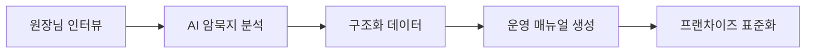

<div align="center">

# AMP Tacit Knowledge

### *원장님 암묵지 진단 앱*

**경험을 데이터로, 노하우를 시스템으로**

[](https://developer.mozilla.org)
[](https://ai.google.dev)
[](LICENSE)

> **"당신의 학원이 원장님 없이도 완벽하게 돌아갈 수 있나요?"**
> 10년 경험의 학원장 노하우를 AI가 구조화합니다. 단순한 텍스트 입력의 한계를 넘어서, 11가지 인터랙션 활동으로 운영 암묵지를 체계적으로 진단하고 매뉴얼 자산으로 변환합니다.

[🚀 라이브 데모 (Vercel)](https://amp-tacit-practice.vercel.app/) · [🐛 이슈 리포트](../../issues)

</div>

---

## 🧠 Philosophy

| 기준 | 기존 방식 | AMP Tacit Knowledge |
|------|----------|---------------------|
| 노하우 전달 | 구두 전수 | **AI 구조화 진단** |
| 매뉴얼 | 수기 작성 | **자동 생성** |
| 프랜차이즈 표준화 | 경험 의존 | **데이터 기반 표준화** |



## 🎯 Getting Started

```bash
git clone https://github.com/Reasonofmoon/amp-tacit-practice.git
cd amp-tacit-practice && npm install && npm run dev
```

## 📄 License

MIT License

<div align="center"><br>

**AMP Tacit Knowledge** · 경험을 시스템으로

Made by [Reason of Moon](https://github.com/Reasonofmoon)

</div>
