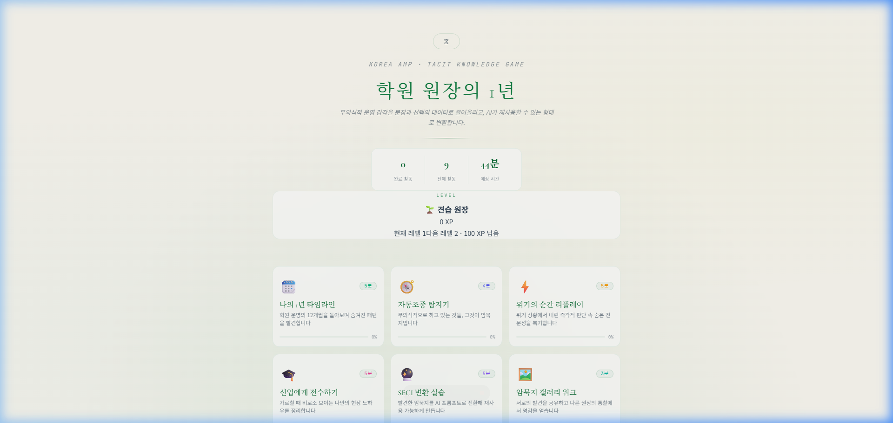
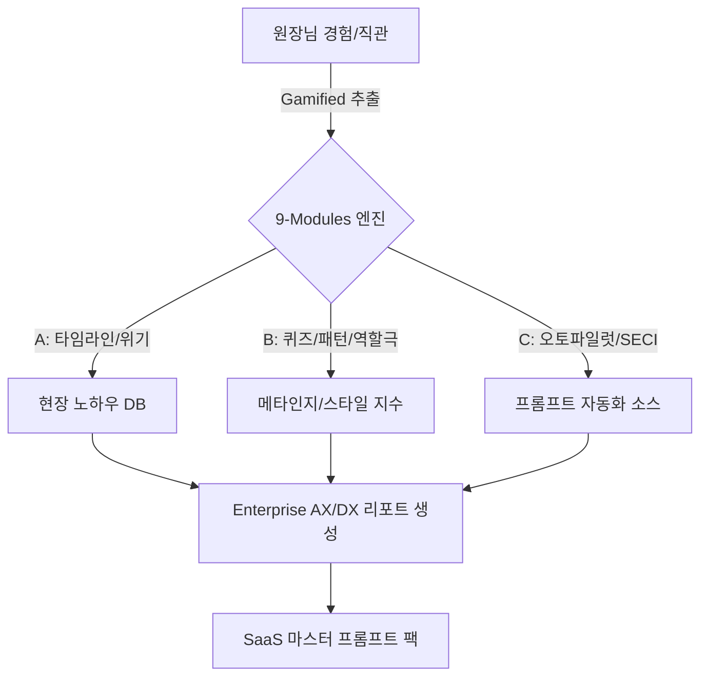
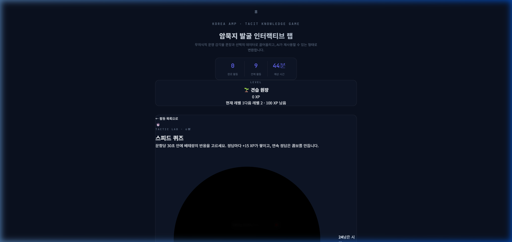
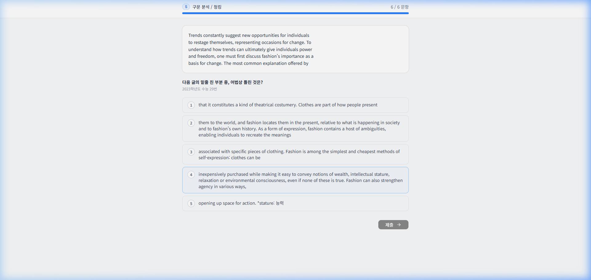

# 🔖 AMP Tacit Knowledge (원장님 암묵지 진단 앱)

### *경험을 데이터로, 노하우를 시스템으로*

**원장님의 머릿속에만 있던 20년 노하우를 인터랙티브하게 추출하고 AI 자산으로 변환하는 SaaS 진단 플랫폼**

> **"당신의 학원이 원장님 없이도 완벽하게 돌아갈 수 있나요?"**
> 단순한 텍스트 입력의 한계를 극복하고, 게임을 하듯 즐겁게 자신의 노하우(암묵지)를 9가지 인터랙션 활동을 통해 쏟아낼 수 있는 차세대 휴먼 지식 추출 엔진입니다.

[🚀 라이브 데모 (Vercel)](https://amp-tacit-practice.vercel.app/) · [🐛 이슈 리포트](../../issues)

---

## 🧠 Philosophy — "왜 만들었는가"

학원 원장님들의 노하우는 문서화되지 않은 '현장 감각'의 영역에 존재합니다. 기존의 일반적인 텍스트 설문지나 구글 폼으로는 이 복잡한 암묵지를 끌어낼 수 없었습니다. 우리는 뇌과학적 인지 부담을 낮추고 성취감을 주는 **Gamified Split-view UX**를 도입하여, 진단 과정 자체가 하나의 '몰입형 게임'이 되도록 아키텍처를 재설계했습니다.

| 기준 | 기존 텍스트 설문 방식 (v1.0) | 차세대 인터랙티브 진단 (v2.0) |
|------|--------------------------------|-------------------------------|
| 포맷 | 상하 스크롤형 평면적 폼 | **모바일/태블릿 최적화 Split-View 카드형UI** |
| 피드백 | 최종 완료 시에만 감사 인사 | **행동 즉시 수평/수직 애니메이션 및 XP 보상** |
| 인지부담 | 방대한 주관식 텍스트 타이핑 강요 | **드래그앤드랍, 짝맞추기, 메타인지 슬라이더**로 대체 |
| 결과물 | 단순 텍스트 모음 | **Enterprise 레벨 AX/DX 마스터 프롬프트 및 레이더 차트** |

---

## ⚙️ 시스템 플로우 및 애니메이션 튜토리얼

사용자가 느끼는 **"Wow Moment"**를 극대화하기 위해 Framer Motion 기반의 세밀한 UI 애니메이션과 플로우를 적용했습니다.

### Phase 1 · 기초 진단 (Foundation)
**"마치 게임의 튜토리얼 노드를 해금하듯 부드러운 시작"**

- **작동 플로우**: 사용자가 `TimelineActivity` 또는 `Sabo Quiz`에 진입합니다.
- **애니메이션 튜토리얼**:
  - `Timeline Drag & Drop`: 화면이 좌우(Split-view)로 분할되며, 이벤트 토큰을 스케줄 슬롯에 드래그하면 자석처럼 부드럽게 스냅(`layout` 애니메이션)됩니다.
  - `Confidence Slider`: 퀴즈 풀이 시, 답안 제출 후 나타나는 메타인지 바(Bar)가 자연스럽게 차오르며 내 확신도를 시각화합니다.
- **Wow 포인트**: 복잡한 일정 관리가 **30초 만에 드래그 완료**되는 직관적 경험 제공.

### Phase 2 · 심화 발굴 (Deepening)
**"선 그어 짝맞추기와 시나리오 채팅을 통한 실전 암묵지 도출"**

- **작동 플로우**: `PatternMatchActivity` 및 `RolePlayActivity` 수행.
- **애니메이션 튜토리얼**:
  - `Pattern Matching`: 좌측 상황 카드와 우측 대응 카드를 클릭하면, 화면 중앙에 연결선(Line) 효과를 주어 논리적 연결을 촉각적으로 인지하게 합니다.
  - `RolePlay Chat`: NPC와의 대화가 카카오톡처럼 애니메이션 버블(`initial={{y: 10, opacity:0}}`)로 팝업됩니다. 
- **Wow 포인트**: 객관식의 지루함 없이, 모바일 메신저를 하듯 **3분 만에 위기 대응 스타일 도출**.

### Phase 3 · 패턴 응용 및 시각화 (Application & Output)
**"파편화된 답변이 하나의 시스템 프롬프트로 융합되는 카타르시스"**

- **작동 플로우**: 모든 활동 완료 시 홈 화면의 "리포트 보기" 버튼이 펄스(Pulse) 애니메이션과 함께 활성화됩니다.
- **애니메이션 튜토리얼**:
  - `Radar Chart`: 리포트 진입 시 6각 레이더 차트가 0에서 100까지 둥글게 스윕하며 렌더링됩니다.
  - `Prompt Pack`: 짙은 다크모드의 코드블록(`pre-wrap`)이 나타나며, "복사하기" 버튼 클릭 시 상태 텍스트가 "✅ 클립보드에 복사됨"으로 반짝입니다.
- **Wow 포인트**: 9가지 단편적 답변이 모여 **버튼 1번으로 엔터프라이즈 AX/DX 컨설팅 리포트 마스터 프롬프트**로 변신!

---

## 🎯 수준별 활용 가이드

### 🟢 Starter — "5분 안에 시스템 파악하기"
1. `npm run dev` 로컬 실행 후 `Onboarding` 이름표를 입력하세요.
2. Home 화면에서 Layer A의 3가지 진단 카드 중 하나를 선택해 플레이해봅니다.
3. 드래그 앤 드랍, 슬라이더를 1회씩 조작해보며 인터랙션 반응을 살핍니다.

### 🔵 Professional — "활동 커스텀 및 질문 추가"
1. `src/data/activities.js` 및 `scenarios.js`를 엽니다.
2. 여러분의 학원(또는 기업) 도메인에 맞는 퀴즈 문항, 타임라인 이슈 토큰을 추가합니다.
3. Vite HMR을 통해 실시간으로 변경된 문항과 NPC 대화를 테스트합니다.

### 🟣 Enterprise — "최종 프롬프트 연동 및 시스템화"
1. 학원의 모든 지점장이 이 웹앱 링크를 통해 10분간 진단을 수행합니다.
2. 마지막 `ResultReport`에서 도출된 **AX/DX 진단 프롬프트**를 복사합니다.
3. 해당 프롬프트를 사내 GPTs 모델 시스템 프롬프트로 이식하여 각 지점별 '운영 AI 봇'을 3분만에 론칭합니다.

---

## 🔧 아키텍처 확장 및 커스터마이징

이 템플릿의 인터랙티브 코어는 모듈식으로 이루어져 있어 확장이 용이합니다.

| 우선순위 | 확장 대상 | 난이도 | 변경 위치 | 범위 |
|----------|------------|--------|-----------|------|
| **1st** | 콘텐츠(질문지, NPC 대사) 수정 | ⭐ | `src/data/*.js` | 퀴즈/시나리오 데이터 |
| **2nd** | 테마 컬러 & 폰트 디자인 | ⭐⭐ | `src/index.css` | 전역 디자인 (CSS 변수) |
| **3rd** | SECI 모델 로직 및 채점 비율 조정 | ⭐⭐⭐ | `src/utils/scoring.js` | 레이더 차트 매핑 알고리즘 |
| **4th** | 신규 Split-view 미니게임 추가 | ⭐⭐⭐⭐ | `src/activities/` | 리액트 컴포넌트 전체 확장 |

---

## 🌐 다국어 지원 (진행 중)

| 항목 | 언어 지원 현황 |
|------|--------------|
| UI 컴포넌트 | 한국어 최적화 (Pretendard 폰트 시스템) |
| System Prompt | 한국어 / English 호환 (엔터프라이즈 프롬프트 내부 적용) |
| 번역 확장을 위한 로케일 | `i18n` 도입 준비 (Phase 4 예정) |

 

  <b>Built with 💙 by Antigravity Agent</b>

